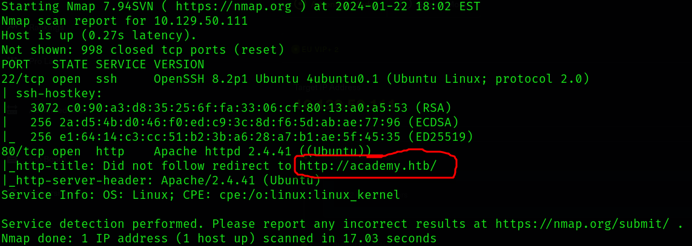

# Academy

<h1 align=center>
    <br>
    <a href=https://app.hackthebox.com/machines/Academy></a>
    <br>
</h1>

***

__Machine IP__:
```bash
10.129.50.111
```
__Date__: 2024-01-22

***

# Nmap


```bash
sudo nmap -sC -sV 10.129.50.111 > Academy/nmap_10.129.50.111
```
The first NMAP scan gave us SSH open and HTTP open.

## SSH
Looking at **OpenSSH 8.2p1 Exploit** on google turns up zero results. But we'll store this as a possible route for later.

## HTTP
### Initial Review
* For HTTP to work we'll need to add academy.htb to our /etc/hosts file.
* After adding the file I ran my httpenum script and while that ran i reviewed what the website looked like.
    - Scan results for `httpenum` returned very little. Only a possible **/admin.php** directory and that the server is Apache/2.4.41.

* Interesting and meta page here. View source isn't pulling anything unique, but you can register a fake account to login. This brings you to a page that looks like HTB, but none of the links appear to redirect anywhere.
    - Reviewing that version of apache led me to [this](https://blog.qualys.com/vulnerabilities-threat-research/2021/10/27/apache-http-server-path-traversal-remote-code-execution-cve-2021-41773-cve-2021-42013) possible exploit, but my attempts to replicate in burpsuite were unsuccessful, likely because there is not an available cgi-bin directory.

### Burpsuite
* Initial use of burpsuite didn't return any meaninful results on repeater, and intruder didn't take for a small brute force on usernames 'admin' and root'. Or so I thought...
    - Lets look at the register feature

* It looks like there is an option to set the role. If we assume it's in binary we can try setting this to one then accessing the admin.php directory. We need to set the role id within burpsuite and then forward the request.

* Page gives us an interesting location to look into. **dev-staging-01.academy.htb**

    - Note that for this page to work you need to add the subdomain to the /etc/hosts file. I added a wildcard to the front to allow me to fuz through other possible subdomains.

* From this page I find some juice creds, but since I'm not able to access the machine I can't access any of these other services. I also don't appear able to make any changes to the code. Reviewing the code doesn't immediately show me anything useful.
    - Looking through the rest of the documentation shows that there is an application running laravel. Which is apparently a [Laravel is a web application framework with expressive, elegant syntax.](https://laravel.com/). Cool so...
    - `searchsploit laravel`
    - Best result is `PHP Laravel Framework 5.5.40 / 5.6.x < 5.6.30 - token Unserialize Remote Command Execution (Metasploit) | linux/remote/47129.rb`
* Make sure you set the correct values using what was found in the document.


* Pulling over linpeas I fould a DB password `mySup3rP4s5w0rd!!` and also found the list of users

> mrb3n:x:1001:1001::/home/mrb3n:/bin/sh 
> cry0l1t3:x:1002:1002::/home/cry0l1t3:/bin/sh 
> mysql:x:112:120:MySQL Server,,,:/nonexistent:/bin/false 
> 21y4d:x:1003:1003::/home/21y4d:/bin/sh 
> ch4p:x:1004:1004::/home/ch4p:/bin/sh 
> g0blin:x:1005:1005::/home/g0blin:/bin/sh 

* Trying this password against these users gets me a shell on cryol1t3.
* From here I'm able to view the user.txt flag so i'm on the right track.


# Privelege Escalation
* Running linpeas again as the new user shows me as part of the (adm) group.

The id command reveals that this user is a member of adm group. The adm group allows users
to read system logs. In Linux all logs are located inside the /var/log folder. Lets change the
directory to /var/log and list the log files.
There are lots of logs but the most interesting one is audit . Let's search online and learn more
about it.
The Linux kernel logs a lot of things but by default it doesn't log TTY input. The audit log allows
sysadmins to log this. If logging of TTY input is enabled, any input including passwords are stored
hex-encoded inside /var/log/audit/audit.log . We can decode these values manually or use
the aureport utility to query and retrieve records of TTY input. To learn more about PAM TTY see
this page. Let's query all TTY logs.
The TTY report reveals that the mrb3n user logged in with the password mrb3n_Ac@d3my! using
su . Let's do the same.
`aureport --tty`

# Root
* From the report we find the login for mrb3n
* With the login for mrb3n we see he can run composer as sudo.
* Checking [GTFOBins](https://gtfobins.github.io/gtfobins/composer/) we see that we can get to root.

