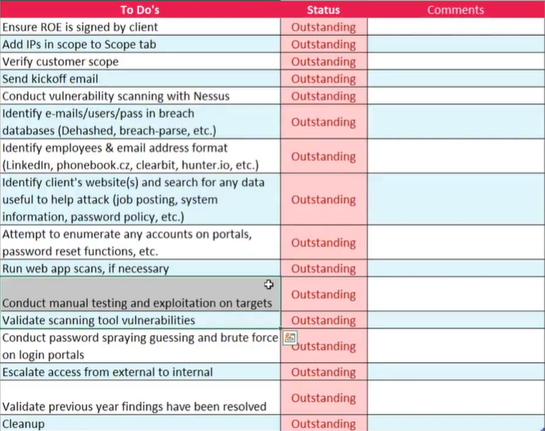

# HackingNotes
Hacking notes is a page that I've built to start my convergence of learning with Vim, GitHub, and several certifications (PNPT & OSCP).

## To-do list
- [x] Learn Vim  
- [x] Learn Git (Beyond the basics, maybe not much more)  
- [ ] Crash Course in Computer Science
    - [ ] Read [Code: The Hidden Language of Computer Hardware and Software](http://charlespetzold.com/code)
    - [x] Watch [Exploring How Computers Work](https://youtu.be/QZwneRb-zqA)
    - [X] Watch all 41 videos of A [Crash Course in Computer Science](https://www.youtube.com/playlist?list=PL8dPuuaLjXtNlUrzyH5r6jN9ulIgZBpdo)
    - [ ] Take the [Build a Modern Computer from First Principles: From Nand to Tetris (Project-Centered Course)](https://www.coursera.org/learn/build-a-computer)
    - [ ] Take the [CS50: Introduction to Computer Science course](https://online-learning.harvard.edu/course/cs50-introduction-computer-science)
- [ ] Learn C Code/Exploits
    - [ ] Grab a copy of [C programming: A Modern Approach](http://knking.com/books/c2/index.html) use as main course on C.
    - [ ] Follow this [Tutorial On Pointers And Arrays In C](https://github.com/jflaherty/ptrtut13)
    - [ ] Complete Hacking book and learn how to build exploits.
- [ ] Learn JavaScript/Obfuscation
    - [ ] Just the Basics of JavaScript
- [ ] Learn PowerShell Commands for Malware
- [ ] Learn CPU/Windows Internals
- [ ] Malware Analysis
    - [ ] Update VMs with useful upgrades.
        - [ ] Modify dieder programs with configuration settings.
    - [ ] Build AWS Server to spin up to access and defang malware./Build a safe network setup.
    - [ ] GREM Course
    - [ ] GREM Certification
        - [ ] Build Index
        - [ ] Re-do labs at least once
        - [ ] Take Practice tests and iterate above.
        - [ ] Learn how to recognize encoding based on look.
        - [ ] Schedule Exam
    - [ ] PMA Book
    - [ ] TCM PMAT Course
    - [ ] TCM PMAT Certification
    - [ ] Reversing Book (The one from amazon instructor showed.)
    - [ ] [Practice](Malware_Analysis/FOR610_Notes.md#practice-sources-for-more-malware-samples)
    - [ ] https://maldevacademy.com/: Amazing site for learning what to look for in malware analysis.
- [ ] Complete PNPT
- [ ] Pass OSCP Exam
- [ ] Learn Docker

## Career Advice
- Become visible: blogs, videos. Maybe review someone elses work to see what they missed.
- Keep practicing
- Entry jobs likely to be as consulting or incident response teams or forensics.

## Useful Links
Here's what I'm using to learn.

Vim: 
- https://thevaluable.dev/vim-commands-beginner/  
- Don't forget to set your vimrc file again. https://www.freecodecamp.org/news/vimrc-configuration-guide-customize-your-vim-editor/
Markdown: 
- https://www.markdownguide.org/cheat-sheet/  
-  https://support.squarespace.com/hc/en-us/articles/206543587-Markdown-cheat-sheet
Methodology:
- The Bug Hunter's Methodology - https://www.youtube.com/watch?v=uKWu6yhnhbQ
- Nahamsec Recon Playlist - https://www.youtube.com/watch?v=MIujSpuDtFY&list=PLKAaMVNxvLmAkqBkzFaOxqs3L66z2n8LA

## Checklist

Always verify scope with a [tool](https://bgp.he.net)

Report Writing: https://github.com/hmaverickadams/TCM-Security-Sample-Pentest-Report

